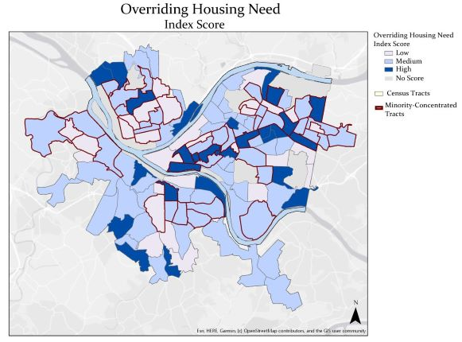

# GIS Briefcase
This is portfolio of a bunch of GIS and map-related work created by Christopher Ibeling
https://christopheribeling.github.io/GIS_briefcase/

# About Me
My name is Christopher. I was born in and raised in the great state of Colorado. This is an early snapshot of what that looked like: 

I did come to appreciate the snow more than the younger me in this photo lets on. My parents owned dry cleaners my entire childhood. So, that meant that I got to spend a lot of time around dry clearning. Like a lot of time. If you're ever in the Cap Hill neighborhood, next to Sexy Pizza and what once was Barricuda's (rest in peace), there's still stands Majestic Cleaners that looks like it has essentially been unchanged since 1988. That was my parents' old shop. 

# What I hope to learn

# Portfolio

# Projects

