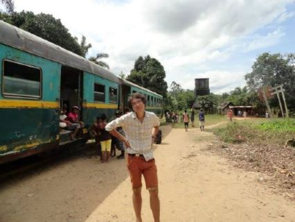

# [GIS Briefcase](https://christopheribeling.github.io/GIS_briefcase/)
This is portfolio of a bunch of GIS and map-related work created by Christopher Ibeling

# About Me
My name is Christopher. I was born in and raised in the great state of Colorado. This is an early snapshot of what that was like: 

I did come to appreciate the snow more than the younger me in this photo lets on.
My parents owned dry cleaners my entire childhood. So, I’ve had the opportunity to spend a lot of time around dry cleaning: as a toddler I was raised in my parents’ shops and working the front counter was my first ever job. If you’re ever in the Cap Hill neighborhood in Denver, next to Sexy Pizza and what once was Barracuda’s (rest in peace), there’s still stands Majestic Cleaners that looks like it has essentially been unchanged since 1988. That was my parents’ first dry cleaners.

I finished college at the University of Colorado with a Bachelors of Arts in History. Getting a degree in History is a near guarantee for more schooling: either as a teacher or as a student in a graduate program. I chose to be an Instructor and joined the Peace Corps. I was placed in a pretty good-sized rural town in Madagascar as an English and sometimes French teacher. Just FYI, Madagascar is an incredible beautiful albeit challenging place to visit, and I would highly recommend that it be on anyone’s travel radar. Just be prepared to wait because that country will make you wait.

*See. Here I am waiting for a train to leave*

After the Peace Corps I moved to New York City and worked for a non-profit that provided housing and homeless services in the Bronx. I started as a Case Manager in a homelessness-prevention program and later moved into a role as a Program Developer. My experience in direct housing services was what motivated me to apply to Heinz and ultimately led me to being in this Advanced GIS class here. . 

# What I hope to learn
I hope to become more professional in my map making abilities. The introductory GIS course provided a good foundation for using ArcGIS pro and map making in general, but could only scratch the surface of some of the software’s advanced features. Learning how to use ArcGIS to a greater capacity and explore some of these features to a greater degree would be a real benefit. With that, it would be helpful to understand how to use take advantage of some of layout and visualization tools to get my maps looking more professional (e.g. best practices with gridlines, extents, layer cutoffs).

# Portfolio
## Google Maps Map Style :: My Syle
[My thoughts on Google Maps Map Style](https://christopheribeling.github.io/GIS_briefcase/google_map_my_style.html)

## ArcGIS Map Style :: My Syle
[Here is my ArcGIS map style](https://arcg.is/0byCOv)

I started with this color palette from this delicous-looking image:

And from those colors, these are some examples of the map style I was able to produce:

## Mapbox :: Creating an Online Map From Scratch
This is my first run-through with Mapbox. Bumps in the road? There may have been a couple. Solutions? There were some of those as well. It was interesting branching outside of ArcGIS for map making. In the end, I was impressed with how quickly Mapbox allows you to produce a pretty good looking map. Here is link to [my Mapbox map](https://api.mapbox.com/styles/v1/cibeling/ck8m4xi5u1cfe1iq8qp0yxnt7.html?fresh=true&title=view&access_token=pk.eyJ1IjoiY2liZWxpbmciLCJhIjoiY2s3eGh1aG83MDBiNjNlcDluMWRjd3Y4NiJ9.2jiyPTr5j2RN3gjHpHEBGw#3.93/37.86/-96.76)

## Module 2 :: Coastal Mississippi Hurricane Katrina Analysis

I found this module to be really enjoyable. The raster layers it produced were very visually satisfying, almost psychodelic.. yet informative. I also learned the word bathymetry as a result of this assignment. So, it also expanded my vocabulary. Here are a couple of the layouts that I produced from the module:

## ArcGIS Insights

As I mentioned in the canvas discussion board, I found ArcGIS Insights really pleasant to work with. Much like the experience with Mapbox, I appreciated how quickly Insights allows you to turn out a pretty polished looking map with just a little bit of data and some processing. Of course, the trade off for Insights is the amount of analysis and autonomy to customize within the software, but with a little data processing, an upload and some growing pains of learning to navigate the software, I was able to produce these visualizations with the opioid distribution dataset:
#### Distibution of Opioids to Mingo County (Weight by dosage)

# Projects

